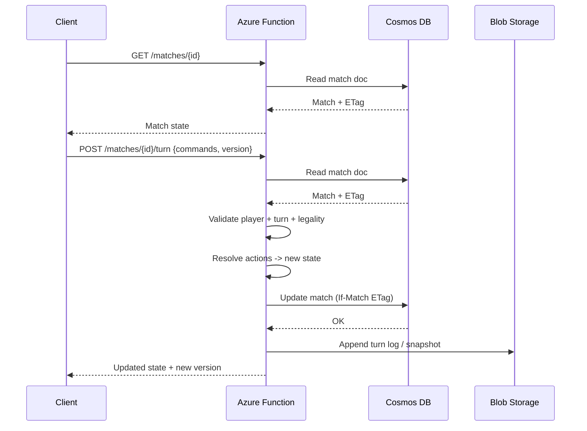

# Migration Plan: Serverless Azure Architecture for BattleGame

This document is the **single source of truth** for migrating BattleGame into a serverless Azure architecture. It is written for future agents to execute incrementally with clear phases, deliverables, and acceptance criteria.

---

## Table of Contents
1. [Assumptions](#assumptions)
2. [Target Architecture](#target-architecture)
3. [Game State Model](#game-state-model)
4. [Turn Submission Flow](#turn-submission-flow)
5. [Concurrency & Consistency](#concurrency--consistency)
6. [Security / Trust Model](#security--trust-model)
7. [API Design](#api-design)
8. [Storage Tradeoffs](#storage-tradeoffs)
9. [Migration Phases](#migration-phases)
10. [Refactor Recommendations](#refactor-recommendations)
11. [Testing Strategy](#testing-strategy)
12. [Observability & Operations](#observability--operations)
13. [Risks & Mitigations](#risks--mitigations)
14. [Concrete Backlog](#concrete-backlog)

---

## Assumptions

### Game & rules
- Turn-based, asynchronous (no real-time simulation).
- Client is **never authoritative** for legality, damage, win state, or turn order.
- Deterministic rules; server resolves all actions.
- Small-to-medium scale initially (hundreds to low thousands of concurrent matches).

### Tech stack
- Frontend: Phaser 3 + TypeScript, built with Vite.
- Engine logic already mostly pure in `src/engine/*`.
- Assets + game data are JSON-driven.

### Unknowns / open questions
- Auth provider choice (SWA auth vs. Azure AD B2C vs. external provider).
- Expected concurrency and peak traffic.
- Whether replay/history is a core feature or optional.

---

## Target Architecture

### Recommended Azure services
| Concern | Service | Rationale |
|---|---|---|
| Frontend hosting | **Azure Static Web Apps** | Free tier, CDN, CI/CD |
| Authentication | **SWA Auth** or **Azure AD B2C** | Token-based, simple |
| API endpoints | **Azure Functions (HTTP)** | Serverless, pay-per-use |
| Turn processing | **Azure Functions** | Stateless, deterministic resolution |
| Active game state | **Cosmos DB (SQL API)** | JSON docs, ETags, flexible queries |
| Replay/history | **Blob Storage** (append-only) | Cheap large storage |
| Static game data | **Static assets / Blob** | Immutable versioned data |
| Matchmaking/list queries | **Cosmos DB** | Query by userId/status |

### Why not Blob Storage as primary datastore?
Blob is great for **append-only logs and snapshots**, but lacks query flexibility and transactional writes for active game state. Cosmos DB provides **document storage + concurrency checks**, which are essential for server-authoritative turn resolution.

---

## Game State Model

### Immutable data (static)
- Unit templates
- Ability definitions
- Map definitions
- Status definitions

### Mutable data (live)
- Match state, unit positions, HP, cooldowns, statuses
- Active player, turn/round counters

### Example types (TypeScript)
```ts
export type Match = {
  id: string;
  version: number;
  status: "pending" | "active" | "complete" | "resigned";
  createdAt: string;
  updatedAt: string;
  activePlayerId: string;
  turnNumber: number;
  roundNumber: number;
  mapId: string;
  players: MatchParticipant[];
  units: UnitState[];
  effects: ActiveEffect[];
};

export type MatchParticipant = {
  userId: string;
  team: "blue" | "red";
  joinedAt: string;
};

export type UnitState = {
  id: string;
  templateId: string;
  ownerUserId: string;
  hp: number;
  x: number;
  y: number;
  status: StatusInstance[];
  cooldowns: Record<string, number>;
  activatedThisRound: boolean;
  defeated: boolean;
};

export type TurnEvent = {
  id: string;
  matchId: string;
  turnNumber: number;
  actorUserId: string;
  submittedAt: string;
  commands: ActionCommand[];
  results: ActionResult[];
};
```

---

## Turn Submission Flow

1. Client requests match state.
2. Client submits **commands** (intent, not resolved state).
3. Function validates identity + turn ownership.
4. Function loads canonical state and validates legality.
5. Function resolves actions deterministically.
6. Function writes new state with ETag/version.
7. Function appends turn log or snapshot.
8. Function returns updated match state.

### Mermaid sequence diagram


---

## Concurrency & Consistency

### Hazards
- Double-submission
- Both players submitting simultaneously
- Stale client state
- Network retries

### Strategy
- Use **ETag / version** for optimistic concurrency.
- If update fails → return `409 Conflict` with latest state.
- Require **turnId** for idempotency; store last processed id.

---

## Security / Trust Model

### Server validation required
- Move legality and pathing
- Ability legality and cooldowns
- Damage calculation
- Status effects and triggers
- Win conditions
- Turn order enforcement

### Auth rules
- JWT validated server-side.
- Only a player in the match may read it.
- Only active player may submit a turn.

---

## API Design

### Minimal endpoints
- `POST /matches`
- `GET /matches`
- `GET /matches/{id}`
- `POST /matches/{id}/turn`
- `GET /matches/{id}/history`
- `POST /matches/{id}/resign`

### Example turn submission payload
```json
{
  "version": 12,
  "turnId": "c1a7b",
  "commands": [
    {"type":"move","unitId":"u1","path":[{"x":2,"y":3}]},
    {"type":"ability","unitId":"u1","abilityId":"fireball","target":{"x":4,"y":3}}
  ]
}
```

---

## Storage Tradeoffs

| Option | Pros | Cons | Fit |
|---|---|---|---|
| Blob Storage | Cheap, scalable | No queries, weak concurrency | Replay/history only |
| Table Storage | Cheap, key-value | Limited query | OK for MVP |
| Cosmos DB | JSON docs, ETags, queries | Cost | Best for active matches |
| Azure SQL | Strong transactions | Heavier ops | Overkill |

**Recommendation:** Cosmos DB serverless for active matches + Blob for history/replays.

---

## Migration Phases

### Phase 1: Local domain model cleanup
- **Goal:** isolate deterministic rules in pure engine.
- **Deliverables:** clean engine, shared types, deterministic RNG.
- **Risks:** hidden Phaser coupling.
- **DoD:** engine runs in Node tests without Phaser.

### Phase 2: Shared rules engine extraction
- **Goal:** shared package for server + client.
- **Deliverables:** `packages/game-core` with `resolveTurn` API.
- **Risks:** data coupling to client assets.
- **DoD:** rules engine imported by Functions.

### Phase 3: Persistence model
- **Goal:** formalize match + turn schemas.
- **Deliverables:** schema + storage adapters.
- **Risks:** mismatch between engine state and storage.
- **DoD:** state can be saved + restored losslessly.

### Phase 4: Azure Functions API
- **Goal:** minimal API endpoints for match play.
- **Deliverables:** create/get/list/submit endpoints.
- **Risks:** auth integration not defined.
- **DoD:** local function host runs end-to-end.

### Phase 5: Auth and identity
- **Goal:** secure identity and authorization.
- **Deliverables:** JWT validation + match authorization.
- **Risks:** provider mismatch.
- **DoD:** only correct player can submit turn.

### Phase 6: Production hardening
- **Goal:** observability + cost guardrails.
- **Deliverables:** logs, traces, alerts, cost budgets.
- **Risks:** high RU cost.
- **DoD:** production readiness checklist complete.

---

## Refactor Recommendations

### Separation of concerns
- **rules-engine/** → deterministic resolution only
- **persistence/** → serialization + snapshots
- **infra-azure/** → Functions + storage clients
- **frontend/** → Phaser UI + state/view logic

**Rule:** client can re-run rules for previews but server is authoritative.

---

## Testing Strategy

- Unit tests for movement/combat/abilities
- Golden tests for full turns
- Serialization round-trip tests
- Idempotency tests (same turnId twice)
- Concurrency tests (ETag conflict)
- Integration tests with local Cosmos emulator

---

## Observability & Operations

- Structured logs per turn: matchId, userId, version, turnId, duration
- Metrics: turn processing time, conflict rate, active matches
- App Insights tracing
- RU budget alerts

---

## Risks & Mitigations

| Risk | Mitigation |
|---|---|
| Blob-only live state | Use Cosmos for active state |
| Rules drift | Shared engine package |
| Double submission | turnId idempotency + ETag |
| Replay mismatch | store resolved results |
| Overcoupled types | shared schema package + versioning |

---

## Concrete Backlog

1. Extract engine types into shared package.
2. Define canonical `Match` and `TurnEvent` schemas.
3. Implement serialization helpers for state snapshots.
4. Write server-side `resolveTurn` wrapper.
5. Add deterministic RNG seed handling.
6. Build local API mock for turn submission.
7. Implement Cosmos DB repository for matches.
8. Implement Blob repository for turn history.
9. Create HTTP Function: create match.
10. Create HTTP Function: get match.
11. Create HTTP Function: submit turn.
12. Add ETag-based optimistic concurrency handling.
13. Add turnId idempotency cache.
14. Add match list query by user.
15. Add resign match endpoint.
16. Add auth middleware for user identity.
17. Add integration tests (Functions + emulator).
18. Add conflict retry tests.
19. Add replay export endpoint.
20. Add telemetry + structured logs.
21. Add CI pipeline for Functions + SWA.
22. Document API contract and schema versioning.
23. Add migration scripts for existing matches.
24. Build admin CLI for inspection/debugging.
25. Cost review + RU budget tuning.
